# Effective Eclipse CDT

***

本文中用eclipse代指eclipse CDT。

本文内容基于当前最新的eclipse neon版本， 请于[eclipse官网](http://www.eclipse.org/downloads/eclipse-packages/)下载，并持续跟踪eclipse最新版本。

## Install

由于windows和mac系统上的安装相对简单，下面的安装过程基于linux系统。我个人在ubuntu14.04下经过测试。

Eclipse安装之前需要先安装[JDK](http://www.oracle.com/technetwork/java/javase/downloads/index.html)。

### Install JDK

- Download JDK

```bash
http://www.oracle.com/technetwork/java/javase/downloads/index.html
```

- Install JDK

```bash
sudo mkdir -p /usr/local/lib/java
sudo tar zxvf jdk-8u91-linux-x64.tar.gz -C /usr/local/lib/java
cd /usr/local/lib/java && sudo ln -s jdk1.8.0_91 default
```

- Export `JAVA_HOME` and `PATH`

```bash
echo "export JAVA_HOME=/usr/local/lib/java/default" >> ~/.bashrc
echo "export PATH=$JAVA_HOME/bin:$PATH" >> ~/.bashrc
source ~/.bashrc
```

- Verify

```bash
$ java -version
```

### Install Eclipse

- Download eclipse

```bash
http://www.eclipse.org/downloads/packages/eclipse-ide-cc-developers/neonr
```

- Install eclipse

```bash
sudo mkdir -p /usr/local/eclipse
sudo tar zxvf eclipse-cpp-neon-R-linux-gtk-x86_64.tar.gz -C /usr/local/eclipse
cd /usr/local/eclipse && sudo ln -s eclipse default
```

- Add eclipse to `PATH`

```bash
echo "export ECLIPSE_HOME=/usr/local/eclipse/default" >> ~/.bashrc
echo "export PATH=$ECLIPSE_HOME:$PATH" >> ~/.bashrc
source ~/.bashrc
```

- Verify

```bash
eclipse &
```

## Global Configuration

初次打开eclipse，如下图。勾掉右下角的`Always show Welcome at start up`，然后点击右上角的`Workbench`图标进入主界面。

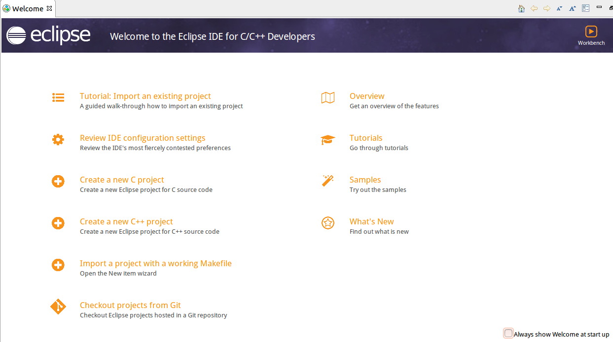

点击菜单栏 `Window -> Preferences`，在里面进行eclipse的全局配置。

### 设置字体

有美感的程序员装好IDE后的第一要事肯定是先配置一个好字体。编码最好使用等宽字体，如果你是在mac系统上，那么默认的字体就很不错；而Ubuntu下自带的”Ubuntu Mono“也很漂亮；Windows上自带的等宽字体"Courier"则有些中规中矩。更换字体时看到名字里面带有`mono`的基本都是等宽字体。

如果想选跨平台的第三方字体，值得推荐的有”Inconsolata“，”Consolas“和”Source Code Pro“。这些字体系统没有自带，需要自行安装。

本文推荐”Source Code Pro“，它是Adobe发布的一款面向程序员的非常漂亮的开源字体集，可以在[github](https://github.com/adobe-fonts/source-code-pro)下载。

#### 安装字体

- Windows系统：
> 将下载下来的”source-code-pro/ttf“目录里的字体文件拷贝到系统盘下”windows/fonts“目录下即可完成安装；

- Linux系统：
> 在个人主目录下建立`.fonts`目录，将下载下来的”source-code-pro/ttf“里面的字体文件拷贝进去即可；

- Mac系统：
> 打开 ”Finder -> 应用程序 -> 字体册“； 添加下载下来的”source-code-pro“目录，即可完成安装；

安装好字体后，重启eclipse。

#### 修改字体

- ** Window -> Preferences -> General -> Appearance -> Colors and Fonts -> C/C\++ -> Editor -> C/C\++ Editor Text Font **

点击Edit，选择自己喜欢的字体；字号一般设置为10或者11比较合适；

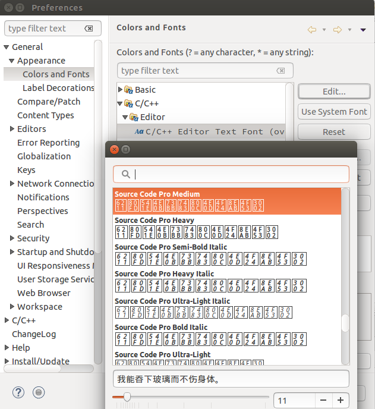

### 修改快捷键

- ** Window -> Preferences -> General -> Keys **

在上面位置进行快捷键设置，我一般直接使用eclipse默认的。

在ubuntu下，eclipse常用的复制行的快捷键`Ctrl + Alt + Down`和系统默认的切换工作区的快捷键冲突了。由于我一般不用ubuntu的扩展工作区，所以我会把ubuntu自身的快捷键进行修改。具体在 `系统设置 -> 键盘 -> 快捷键 -> 导航 -> 切换至上侧工作区` 以及 `切换至下侧工作区`，将这两个快捷键删除，或者改成别的。

### 设置代码风格

代码风格是一个仁者见仁的事情，下文的所有配置都是我比较喜欢的风格，你可以根据自己的口味进行调整。

- ** Window -> Preferences -> General -> Editors -> Text Editors **

将`Displayed tab witdth`设为4； 勾选上`Insert spaces for tabs` 以及 `Show line number`。

- ** Window -> Preferences -> C/C++ -> Code Style -> Code Templates **

在这里配置各种默认代码模板，包含文件头注释模板、函数头注释模板、以及各种文件模板。例如我一般会在这里对C++默认的头文件模板进行修改，去掉文件头注释，去掉文件结尾对”include guard“的重复注释等等。

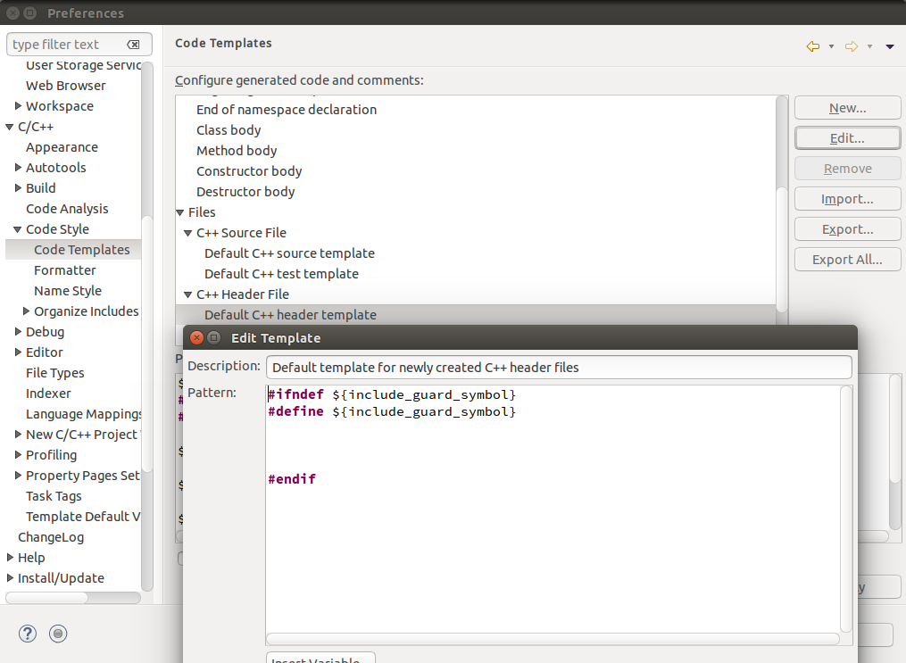

在这里可以点击`Export`将自己配置好的Code Templates导出去，以便备份和共享。

- ** Window -> Preferences -> C/C++ -> Code Style -> Formatter **

在这里设置默认的代码格式化风格。由于我个人喜欢大括号单独一行对齐，所以一般基于eclipse自带的`BSD/Allman`模板进行修改。

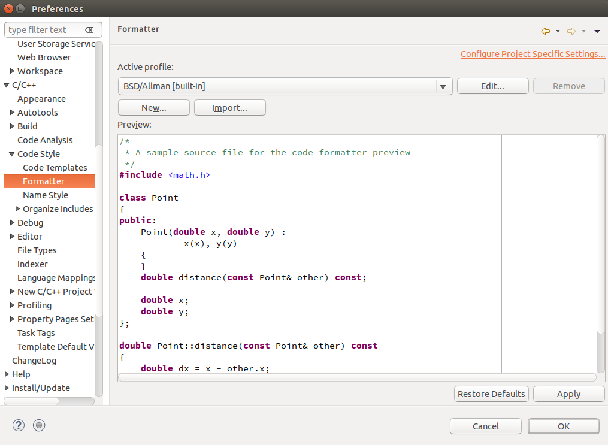

如上图，在Active profile中选择BSD/Allman后，点击Edit进行修改。我一般的修改如下：

    - Indentation:
        - Tab policy : 改为 ”Spaces only“
        - Statements within switch body ： 打上勾
        - Declarations within namespace definition： 打上勾
        - Empty lines ： 打上勾
	- Braces:
		- Initializer list ： 改为 ”Same line“
	- New Lines:
		- before colon in constructor initialzer list : 打上勾
	- Control Statements:
		- Insert new line before catch in a try statement : 打上勾
		- Keep simple if on one line : 打上勾
	- Line Wrapping:
		- Function declarations -> Constructor initializer list :
			- Default indentation for wrapped lines : 设为0
			- Default indentation for initializer lists ： 设为0

最后对设置好的code formatter起个新名字。可以在这里点击`Export`将配置好的formatter导出去，以便备份和共享。

- ** Window -> Preferences -> C/C++ -> Code Style -> Name Style **

在 `Code -> Include Guard`里面，将`Include guard macro name`设置为`Unique identifier`；

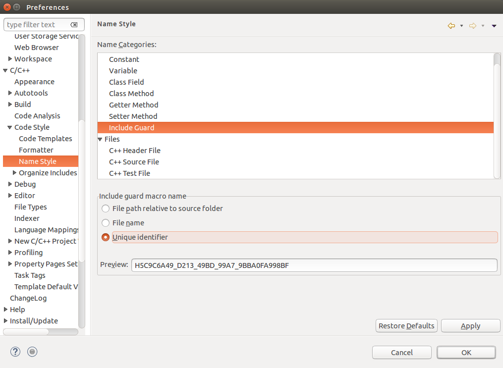

这样eclipse自动生成的头文件模板里面，头文件的include guard默认为一个随机的全局唯一UUID，这样设置的原因是当你重命名头文件或者修改头文件路径后，不用再去手动修改头文件的include guard，避免include guard不小心重名导致的难以定位的编译问题。

另外在当前页面下，可以配置C\++头文件名、源文件名以及测试文件名之间的规则关系，见下图。在开发的过程中遵守这里配置的文件命名规范，会有很多好处。首先eclipse靠这里的文件命名规则关联类的头文件和实现文件。当你的类名、头文件名、实现文件名和测试文件名按照上图中的配置规则保持一致，重命名类名后，eclipse会自动关联修改头文件名，实现文件名和测试文件名以及所有对头文件的include路径名。

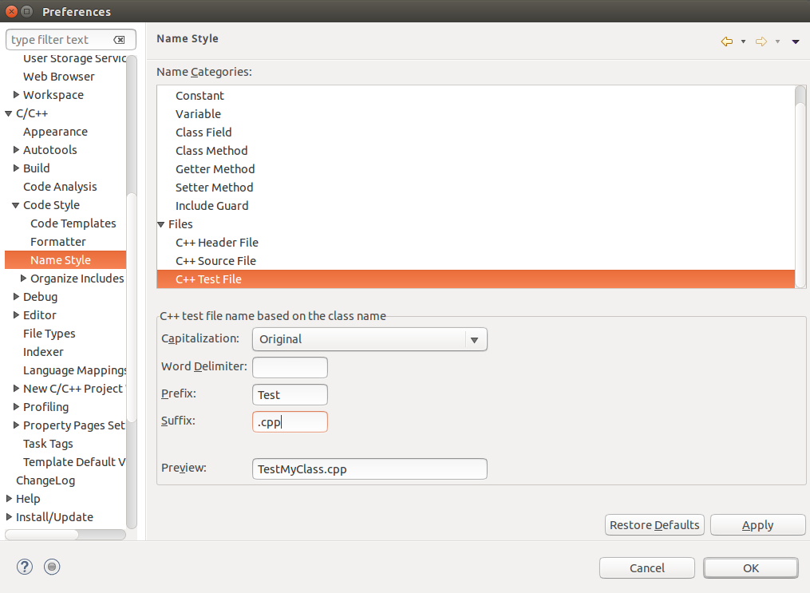

这里我一般会将 `Files -> C\++ Test File` 中 `Prefix`设置为"Test"， `Suffix`设置为".cpp"，让测试文件名称保持 ”Test*.cpp“。

- ** Window -> Preferences -> C/C++ -> Code Style -> Organize Includes **

该栏目下设置和头文件包含相关的选项。Eclipse默认对自动添加的头文件按照设置的规则进行排序。如果不想要自动排序，那么就勾选掉 `Allow reordering of includes`。

在 `Organize Includes -> Include Style`中可以设置头文件包含规则和顺序。

在 `Grouping`标签页里面，我一般会设置所有的头文件类型以尖括号包含（将`Use angle brackets`打钩）。另外，设置系统头文件和前面所有的空一行（选择`System Header`，将`Separate from previous includes by a blank line`打钩）；

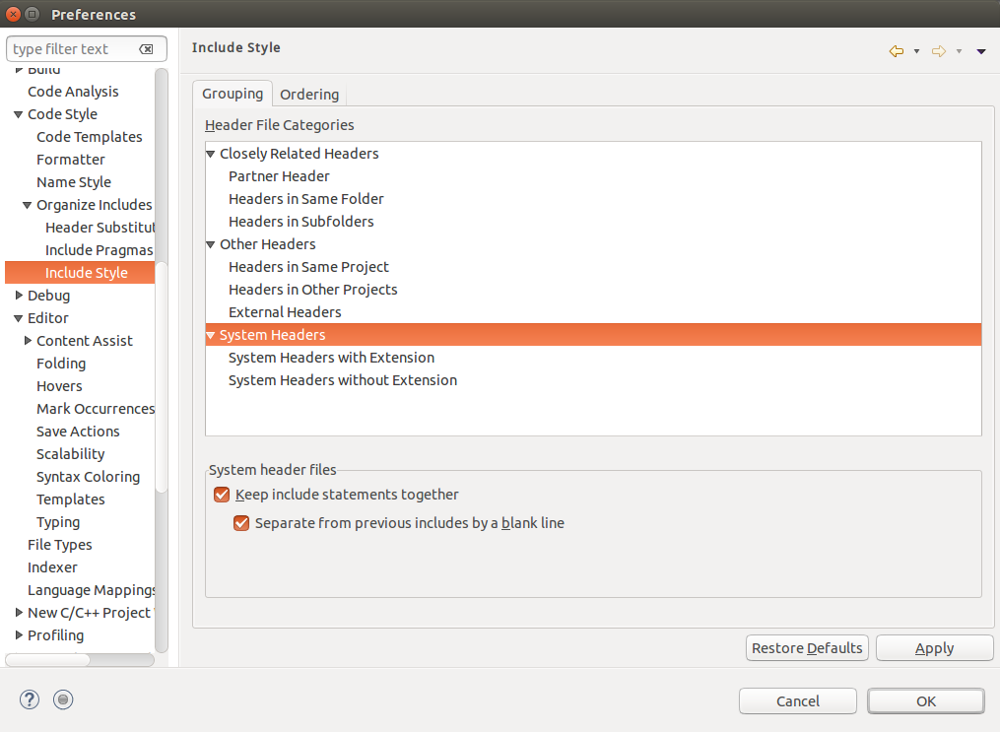

在 `Ordering`标签页中，我会调整头文件的包含顺序，将系统文件放在最后，如下图：

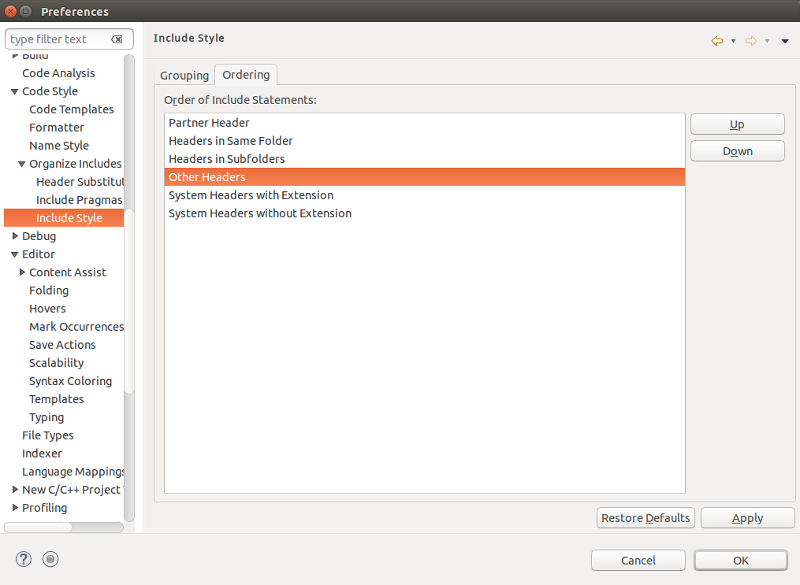

- ** Window -> Preferences -> C/C++ -> Editor -> Syntax Coloring **

该标签下可以设置语法配色方案。我一般只改一点，就是宏引用的颜色。因为宏一般被我作为语法糖来来用，所以希望其色彩和关键字比较像（偏暗红，类似关键字，但有所区别）。修改如下：

在 `Code -> Macro references` 下，将`Enable`和`Bold`打钩，然后点击`Color`，将颜色调为`#BF4040`。

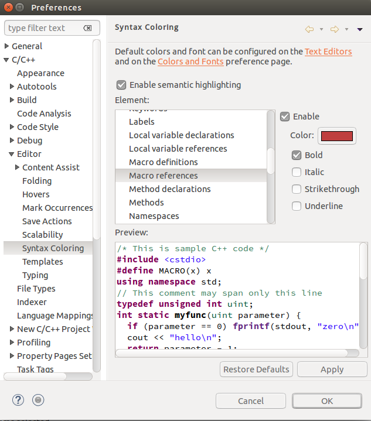

### Others

- ** Window -> Preferences -> C/C++ -> Editor -> Scalability **

在该标签里面可以设置eclipse解析文件规模的一些选项。最关键的一个是`Enable scalability mode when the number of lines in the file is more than`用来设置默认最大完全解析的文件行数，默认是5000。对超过5000行的文件eclipse为了避免消耗资源过多将会只进行部分解析，至于解析哪些，可以在下面进行设置。在eclipse下开发，不建议产生大文件。如果是阅读遗留代码，可以根据自己系统资源能力将5000改的更大。

- ** Window -> Preferences -> C/C++ -> Editor -> Templates **

在这里New一种新的代码template，取名cn，Pattern设为`${file_base}::`。这样当你类名（假如MyClass）和文件名（MyClass.cpp）相同的时候，你在文件内敲cn会自动补全为`MyClass::`。这样在实现文件内写类的成员函数实现时会比较方便。

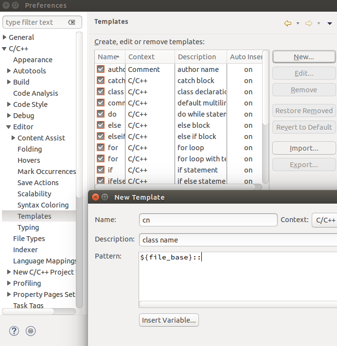

这里还可以配置其它代码块模板，配置好后可以点`Export`将其导出。

- ** Window -> Preferences -> C/C++ -> File Types **

这里可以增加新的文件类型。我一般会用`*.tcc`类型的文件做模板的实现，所以在这里增加新的文件类型。点击New，创建新的文件类型`*.tcc`，Type设为`C\++ Header File`。

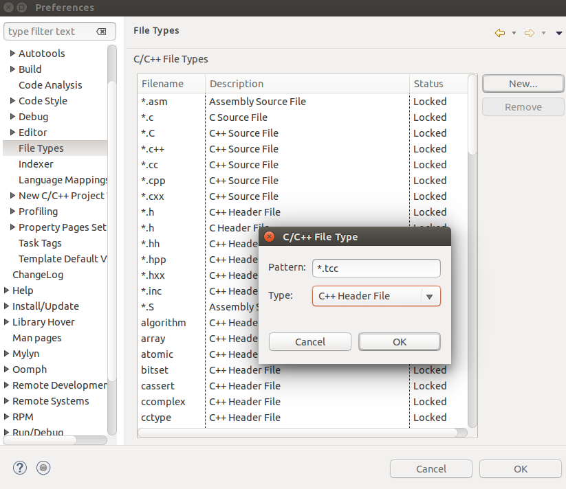

- ** Window -> Preferences -> General -> Workspace **

关于workspace的设置，有两个可以关注。一个是设置eclipse构建前自动保存所有文件`Save automatically before build`；另一个是当代码注释中出现中文乱码时，尝试修改最底下的 `Text file encoding`，将其改为`GBK`。建议最好还是不要用中文注释的好，避免编码不一致带来的乱码问题。

- ** 导出配置 **

前面介绍的Code Templates, Code Formatter, Editor Templates需要单独导出成xml文件！

其余的主要配置，可以通过 `File -> Export -> General -> Preferences` 进行导出。勾选你要导出的选项，然后将其导出为一个epf文件。

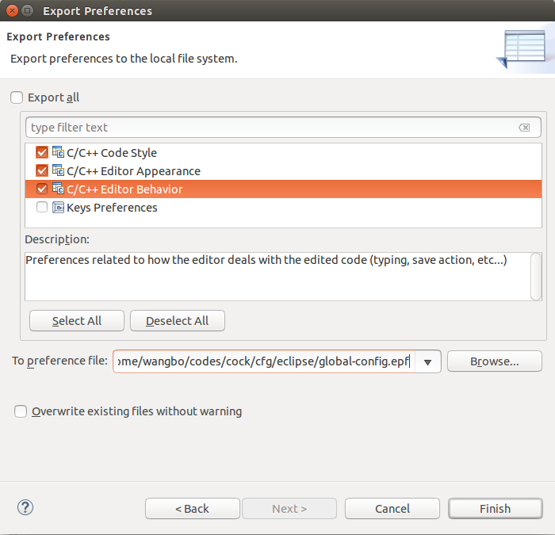

关于前面介绍的Code Formatter和全局配置我已经导出了，见`export/code-formatter.xml`和`export/global-config.epf`。

其中global-config.epf是全局配置，选择 `File -> Import -> General -> Preferences` 将其导入eclipse。

code-formatter.xml是formatter的模板，在`Window -> Preferences -> C/C++ -> Code Style -> Formatter`中点击`Import`将其导入。

## Project Configuration

由于前面介绍的全局配置会作为工程的默认配置，所以像代码风格之类的配置，如果工程没有特殊需要一般不用再配置。工程属性里面主要关注于工程的构建选项。只要配置好了各种构建参数，就可以通过eclipse来构建工程，这时工程代码也能够被eclipse正常解析（对于我个人，更加喜欢用脚本构建，在eclipse里进行工程配置主要是为了让其能够正确解析代码）。

### 新建工程

通过`File -> New -> C++ Project`来创建一个新的C\++工程。如下图，eclipse支持创建几种不同类型的工程；

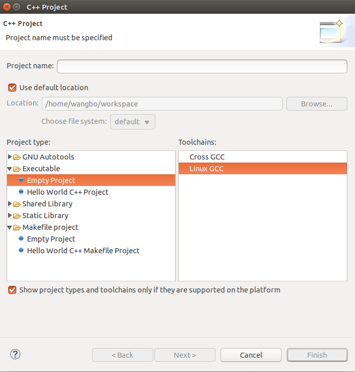

对上图中的元素说明如下：

- Project name ： 工程名。

- Use default location ： 勾选此项的话，项目默认创建在eclipse workspace目录下；如果不勾选，那么在`Location`处可以选择项目位置。如果你已经有了项目目录，想要直接把eclipse工程文件创建在自己的代码目录里，就选择后者。

- Project Type：可以选择构建的工程类型

	- GNU Autotools：该类项目默认选择用GUN Autotools进行构建管理，eclipse不会为其自动生成makefile。在项目的属性对话框里面将会有一个对GNU Autotools的配置页面。

	- Executable：可执行项目，eclipse默认会为其生成makefile。该类工程允许在工程属性对话框里面深入配置各种编译链接参数，这些配置的修改都会决定自动生成的makefile内容。`Empty Project`和`Hello World C++ Project`的区别在于后者会自动为项目创建一个src目录以及一个实现了输出“hello world”的cpp文件。

	- Makefile Project：该类工程默认用户使用自定义的makefile，不会为项目自动创建makefile。该类工程的工程属性对话框里面默认不可以对编译、链接参数进行配置，它会使用用户makefile中的参数进行项目解析。

	- Shared Library：共享库工程。默认项目的构建结果为共享库，在工程属性里面会有对共享库的各种构建配置选项；

	- Static Library：静态库工程。默认项目的构建结果为静态库，在工程属性里面会有对静态库的各种构建配置选项；

- Toolchains：工具链。该对话框里eclipse会自动识别系统安装的工具链。例如如果你安装了cygwin或者minGW的工具链，也会显示在这里以供选择。如果使用Linux下默认的工具链，则选择`Linxu GCC`。如果选择`Cross GCC`，说明项目是交叉编译，那么工程属性对话框里面需要进行交叉工具链的各种配置。


### 导入工程

如果工程已经有了eclipse项目文件，那么可以直接导入到eclipse中。

选择`File -> import -> General -> Existing Projects info Workspace`， 然后下一步，在接下来的对话框里面选择eclipse项目文件所在的目录，然后确认，将其导入eclipse中。

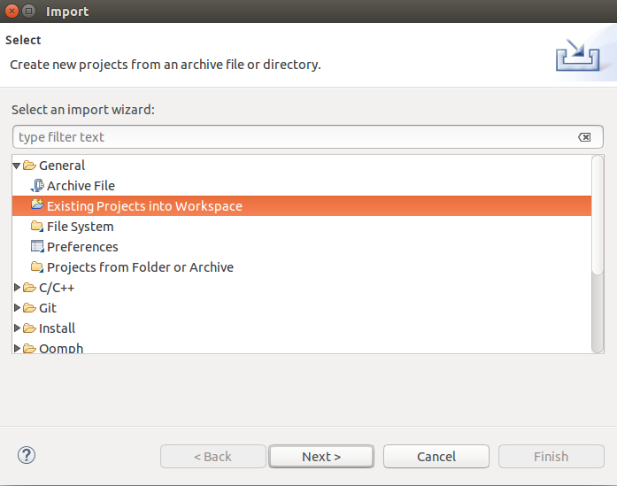

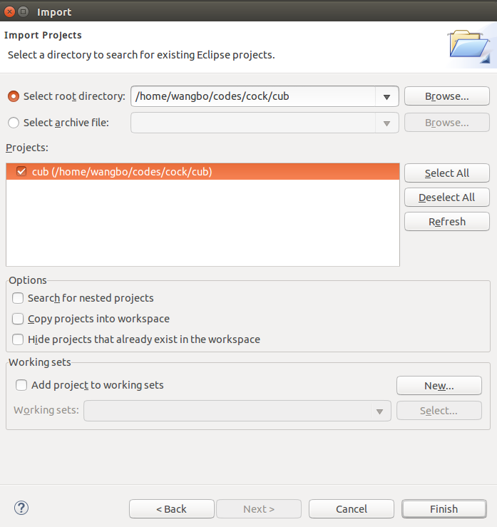

### 配置工程

对于创建好的eclipse工程，可以在工程属性对话框里对其进行更为详细的配置。在Project Explorer视图里的具体工程上点右键，选择`Properties`。

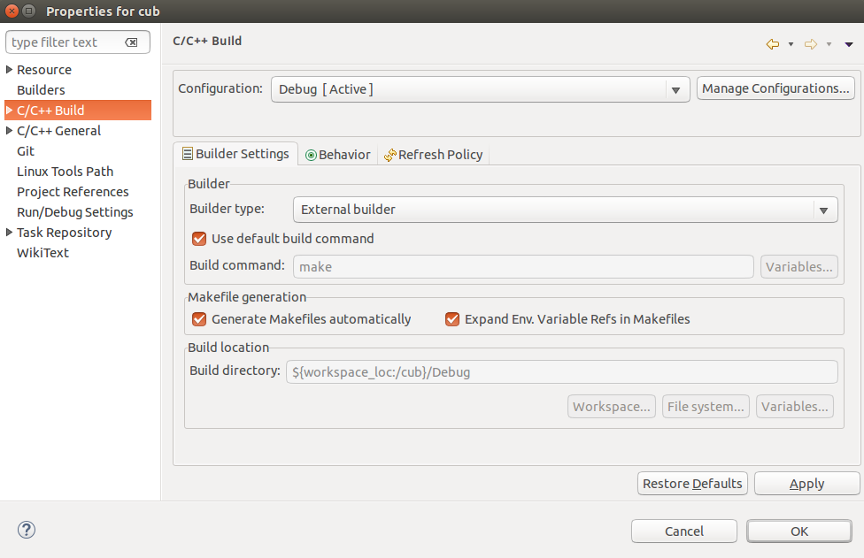

在工程属性对话框里面，最为重要的是`C/C++ Build`以及`C/C++ General`这两个配置集。这两个配置集包含所有和工程构建相关的配置。如果你要用eclipse进行构建，那么这里面的东西就极为重要，因为它决定了项目能否被正确构建。如果你有自己的构建脚本，这里面的东西仍然极为重要，因为它决定了项目代码能否被eclipse正确解析！

#### `C/C++ Build`配置集

在工程属性对话框中选择`C/C++ Build`对构建进行配置：

- Configuration： 这里可以设置构建目标。Executable类型的工程，默认有`Debug`和`Release`两种构建目标可以选择，Makefile类型的工程只有一个`Default`目标。你可以分别配置每一类目标下的编译构建参数。每种构建目标的编译链接参数一般为了不同目的而配置。例如一般在`Debug`目标下我们在配置编译参数时会选择不打开优化选项，但是会设置为目标文件构建debug信息；而`Release`目标的构建参数则选择不构建debug信息，但是需要打开对应的编译优化选项。构建目标后面的`[Active]`指eclipse默认选择的构建配置（当按快捷键`Ctrl + b`进行构建时）。点击后面的`Manage Configurations...`可以对构建目标进行增加、删除和修改。如下图新增了一种构建目标build，将其设为active。

	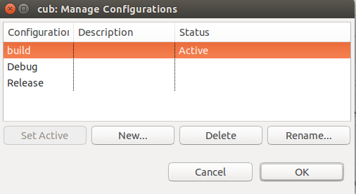

- Builder Settings：
	- Builder type：
		- External builder：选择可以使用外部构建工具进行构建。选中此选项后，底下就可以进行更多的配置。例如可以将`Use default build command`的勾去掉，然后将`Build command`从默认的`make`改为其它自定义工具或者脚本（如果你想使用项目已有的构建脚本，就在此处更改）。另外，可以将`Generate Makefiles automatically`去掉，手动填写构建目标产物的位置。如下图示例，将构建命令修改为使用项目根目录下的`build.sh`脚本，将构建结果放在项目根目录下的build目录下。

		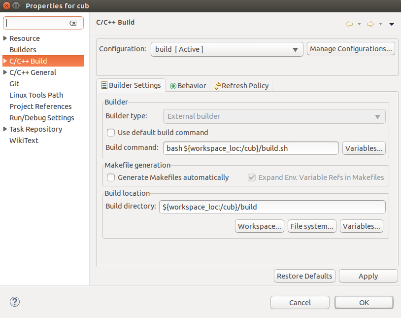

        - Internal type：选择使用eclipse的默认构建工具进行构建，所谓默认构建工具就是在创建工程时所选择的工具链。一旦选择Internal type，那么底下的选项就不能再修改了。例如下图选择`Internal type`，则eclipse固定使用make进行构建，并强制自动生成makefile。

        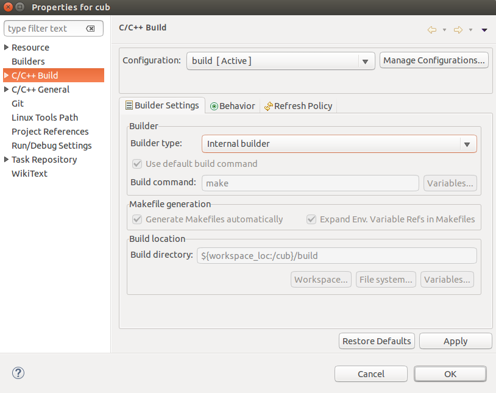

    - Makefile generaton : 配置eclipse是否自动产生makefile。如果工程类型是executable，这里默认是勾选状态；否则默认是不勾选的。只有这里勾选了让eclipse自行产生makefile，工程属性里面才会出现配置编译器、链接器参数的对话框，否则是看不见的（具体在`Project properties -> C/C++ Build -> Settings`）。

	- Build location：设置构建产物的位置。默认在工程根目录下的第一级子目录，子目录的名称固定和当前的`Configuration`栏所选的构建目标相同。

- Behavior : 设置一些构建行为参数。例如编译错误是否立即停止；并行编译选项等等；

	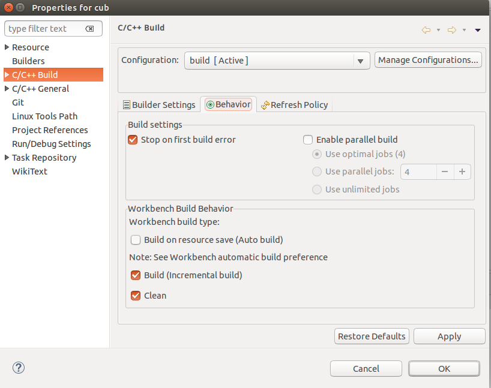

- `C/C++ Build -> Settings`: 如前面所说，只有勾选了让eclipse自行产生makefile，这里面才会有进行编译、链接参数配置的对话框，否则是看不见的。如下图：

	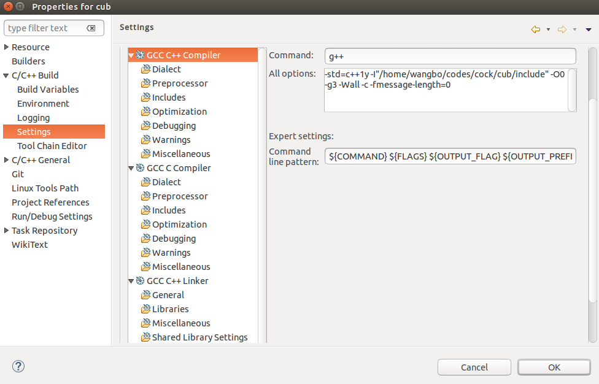

    可以看到这里可以设置编译、链接的各种具体参数。例如上图中对于`GCC C++ Compiler`设置的命令名称是`g++`，`All options`里面是所有的编译参数。这里的编译参数其实都是根据底下的一系列选项设置汇总过来的。
    - `Dialect`里面可以选择支持的C\++标准，支持C\++98、C\++0x以及C\++1y几个选项。
    - `Preprocessor`里面可以配置传递给编译器的预编译参数。
    - `Includes`配置头文件的查找路径，以及包含特定的头文件。
    - `Optimization`配置编译优化选项，例如优化级别`-O`设置。
    - `Debugging`配置debug参数，例如选择debug级别等等。
    - `Warnings`配置编译告警选项。
    - `Miscellaneous`：其他杂项配置。例如是否开启`-v`，`-fPIC`等。

	如果你会写makefile，那么上述所有配置对你来说是非常轻松的，正确配置了这些参数后，eclipse就可以自动为你生成makefile执行构建了。如果你的项目已经有了构建脚本，那么你可以参照构建脚本来配置这里。

#### `C/C++ General`配置集

如下图，在工程属性里面选择`C/C++ General`，可以在其子标签页中进行代码静态检查、文件类型、代码风格等一些配置。由于这些大多在eclipse全局配置中设置过了，所以如果工程没有特殊需求，这里一般不用更改了。

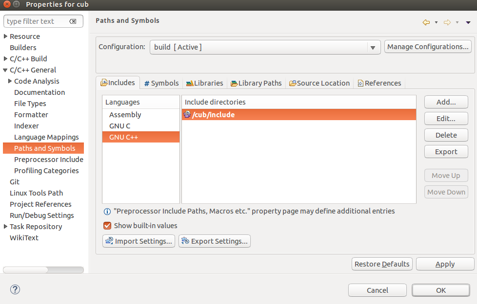

在这里最重要的一个配置页是`Paths and Symbols`。在此可以设置头文件的搜索路径、预编译宏、链接库搜索路径、链接库名称等等。这些设置关系着eclipse能否正确构建以及解析代码符号。可以看到这里的一些配置和前面`C/C++ Build -> Settings`中编译、链接参数的一些配置是重复的。由于编译链接参数需要针对不同的构建目标分别配置，容易有重复；而且一旦不选择让eclipse生成makefile，编译链接参数配置就不可见。但是无论是否让eclipse生成makefile，它总要能正确解析代码的，所以eclipse在这里也提供了类似的配置选项。

这里`Includes`、`Symbols`、`Libraries`、`Library Paths`的配置，和前面编译链接参数配置一样，需要根据工程的具体构建情况去填写。此处只详细说一下`Source Location`选项。

如果你的eclipse工程文件就配置在项目代码目录里，那么这里一般不用配置。你在代码目录里面的目录变化会自动反映到eclipse中。如果你的工程文件和代码目录是分离的，那么就需要在这里进行目录关联。

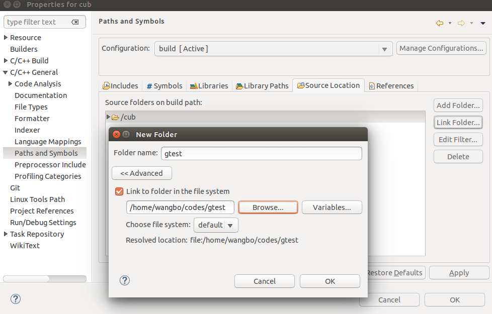

如上图，在`Source Location`中点击`Link Folder...`，然后在弹出的对话框里面点击`Advanced`，勾选`Link to folder in the file system`，接下来点击`Browse...`在文件系统内选择需要关联的目录，之后该外部目录就被映射到eclipse工程内了。在此为了让配置和具体位置无关，可以选择使用`Variables...`，例如`${PROJECT_LOC}`表示当前工程的目录位置，`${WORKSPACE_LOC}`表示eclipse workspace的目录位置。

如上就是工程的所有重要的配置了。一旦配置正确，eclipse就能帮你执行构建了。现实中一般工程都有构建脚本，配置工程属性主要是为了让eclipse能够正确解析代码，这时主要配置好`C/C++ General -> Paths and Symbols`就好了。如果需要eclipse能够解析C\++11或者其它的C\++标准的语法和stl库符号，那么还需在`C/C++ Build -> Settings`中配置编译参数支持对应的C\++标准。

### 导出工程配置

配置好的工程构建属性可以导出然后共享给项目其他同事。

在菜单中选择`File -> Export -> C/C++ -> C/C++ Project Settings`，然后选择对应的工程，选择构建目标，可以将该工程对应构建目标下的配置导出成一个xml文件。这样别人就可以通过`File -> Import -> C/C++ -> C/C++ Project Settings`再将其导入了。

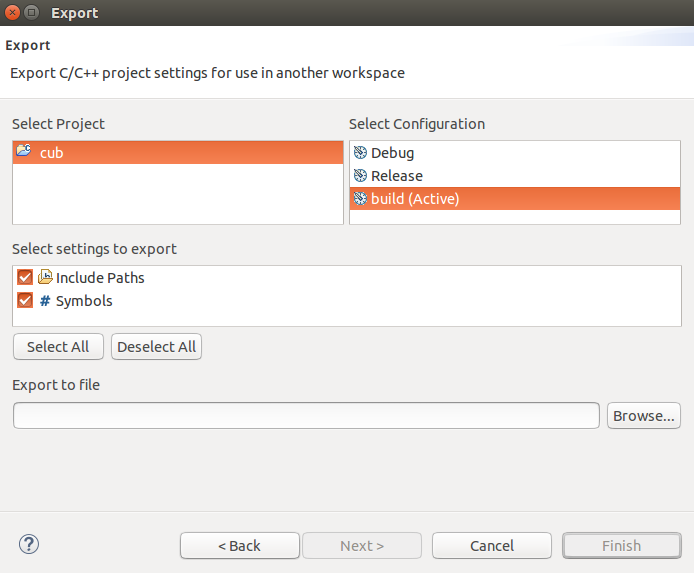

Eclipse为每个工程生成的所有配置其实都在工程目录下的`.project`和`.cproject`文件里。将这两个文件共享给别人，放在相对于工程代码相同的位置，通过`File -> import -> General -> Existing Projects info Workspace`可以直接将eclipse工程导入。

## Efficient Usage

大多数介绍如何高效操作eclipse的文章都主要在介绍快捷键，本章也不例外！但如果仅仅只是快捷键列表，那大家直接google或者看eclipse帮助文档就够了！本章希望先帮大家理清各种概念，然后通过一些主要的快捷键操作场景，帮大家把之前断裂的快捷键操作串起来，以达到一种接近全键盘的行云流水般的操作境界！

### 基本概念

#### Perspective

Perspective翻译过来是“透视图”，其实就是按照一定目的选择和排列好的一组视图（view）的集合。例如Eclipse workbench默认处于`C/C++ Perspective`，它的布局如下图：

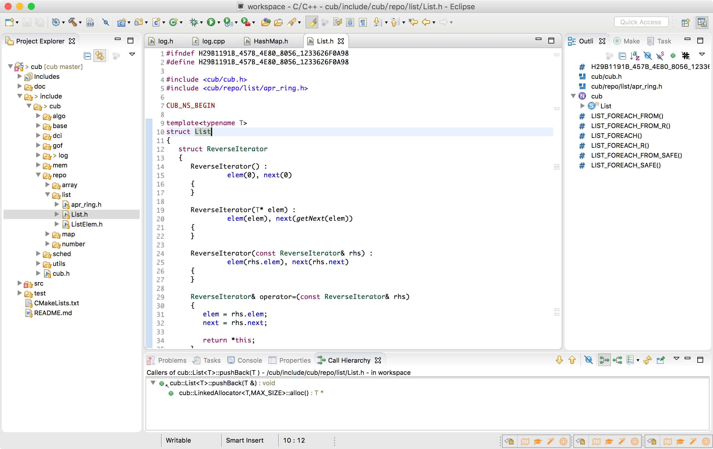

上面是菜单栏和工具栏，下面是由四部分组成的工作区域。最左边是`Project Explorer`视图，显示当前workspace中的所有project，通过它可以浏览每个project的目录树。中间的`Editor`视图是我们浏览、编辑代码的地方。`Editor`的右面和下面是一些辅助视图的集合窗口，例如常用的outline视图、console视图以及各种搜索结果视图等等都在这里，你可以根据习惯选择将哪些视图放在右面或者下面。`C/C++ Perspective`如此设置和排布目的是为了尽可能方便的进行代码开发。

除了`C/C++ Perspective`，eclipse还定义了`Debug Perspective`、`Git Perspective`、`Planning Perspective`等等，每种perspective所选择的视图和排布都是为了不同的目的。例如在`Debug Perspective`下就没有`Project Explorer`视图，而多了`Debug`和`Variable`视图，而且`Editor`视图所占的区域也小很多。如此规划就是为了用户可以方便高效地进行debug。

不同perspective之间进行切换的快捷键是`Ctrl + F8`。按住`Ctrl`后每敲一次`F8`，光标会移到下一个perspective；按住`Ctrl + Shift`后每敲一次`F8`光标会移到前一个perspective。如下图所示，通过快捷键在`C/C++ Perspective`和`Debug Perspective`之间切换。

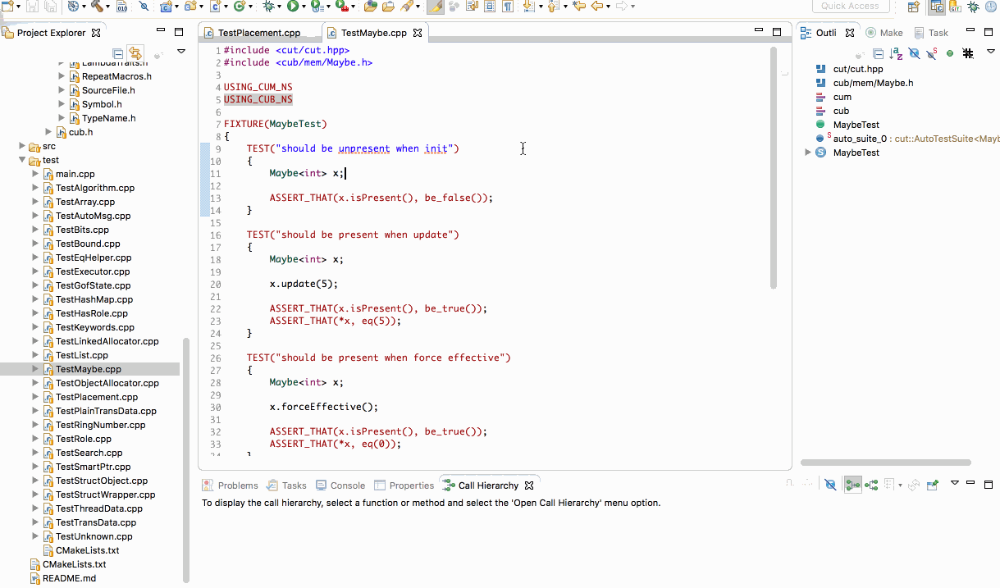

#### View

通过前面的介绍，我们知道一个perspective是由一组view组成。如论在哪个perspective下，我们都经常需要在不同的view之间切换焦点。例如对于我们最常处于的`C/C++ Perspective`，我们在代码开发的时候经常需要从正在编辑代码的`Editor`视图跳转到`Project Explorer`视图去增加一个目录或者文件。再比如搜索了某一个函数的调用关系后需要从`Editor`视图跳转到下方的`Call Hierarchy`视图选择某一调用函数。


切换视图的快捷键是`Ctrl + F7`。按住`Ctrl`后每敲一次`F7`，光标会移到下一个视图；按住`Ctrl + Shift`后每敲一次`F7`光标会移到前一个视图。

如下图所示，我们通过快捷键从`Editor`视图跳转到`Project Explorer`视图下，在test目录下创建Test.cpp文件。

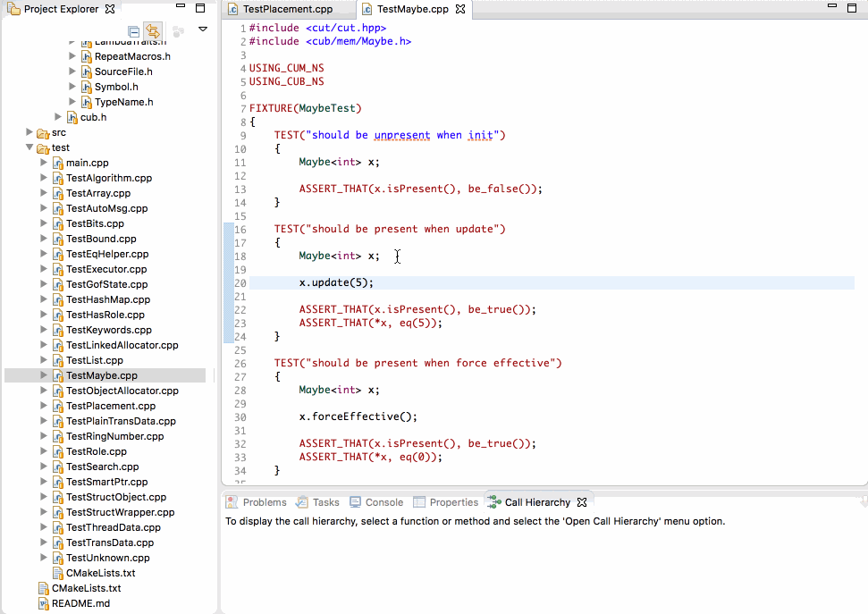

由于经常需要直接跳回`Editor`视图，所以有一个专门的快捷键`F12`用于帮助你从任何视图下直接跳回到`Editor`视图。

如果说切换perspective的快捷键用的场景并不多，那么切换视图的快捷键使用场景那可是相当之多。很多人在`Editor`区域将快捷键使用的很好，但一旦要切换视图就必须去抓鼠标，掌握了这个快捷键基本上就可以让很多人直接过渡到全键盘了！

#### Quick View

在前面的介绍中我们说view一般在perspective下被安排好了位置，从一个view切换到另一个view需要转移焦点。但是eclipse为了可以更加快捷的操作，为很多常用的view提供了quick view。所谓quick view是指在当前view上以一个浮现式菜单弹出另一个view的常用功能，你可以在当前view上不转移焦点就直接操作另一个view，避免了不少键盘操作。熟练掌握quick view可以让你的键盘操作效率更高，更加有行云流水的感觉。

例如前面的例子中我们从`Editor`视图切换到`Project Explorer`视图下创建了一个文件。其实我们可以直接在`Editor`视图下通过`Alt + Shift + N`调出quick view完成文件创建。

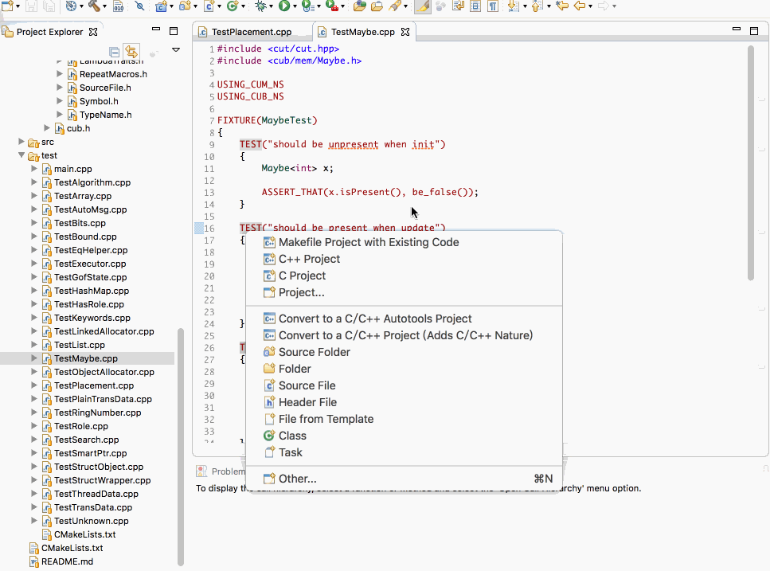

上面介绍的`Alt + Shift + N`会被经常用到，因为它除了可以快速创建文件，还可以快速创建工程、目录等。除此之外还有如下的quick view也非常有用：

- 常用视图集（Quick Views）

	用`Alt + Shift + W`可以直接以quick view的方式显示常用的视图集合，可以通过上下方向键直接选择想要跳转到的目标视图。

	下例中我们通过这种快捷方式直接跳转到`C/C++ Projects`视图。

    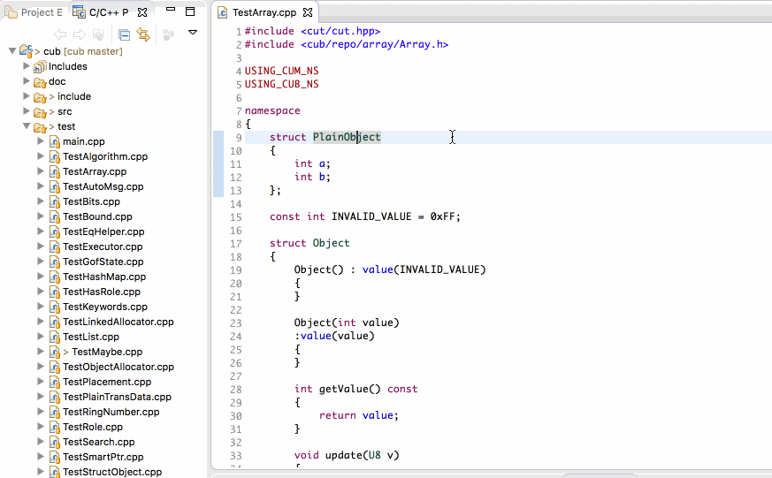

- 文件大纲（Outline View）

	文件大纲视图一般位于`C/C++ Perspective`的最右侧，通过该视图我们可以看到当前文件的代码大纲，通过它可以直接跳到当前文件的任意符号处。

    在`Editor`视图下我们可以通过`Ctrl + O`直接调出`Outline`的quick view，然后通过搜索或者上下键选择来跳转到本文件内的某一符号处。正是因为可以如此方便地调出quick outline，所以我一般会把`Editor`视图右边的辅助视图集窗口最小化以扩大代码区的面积。

    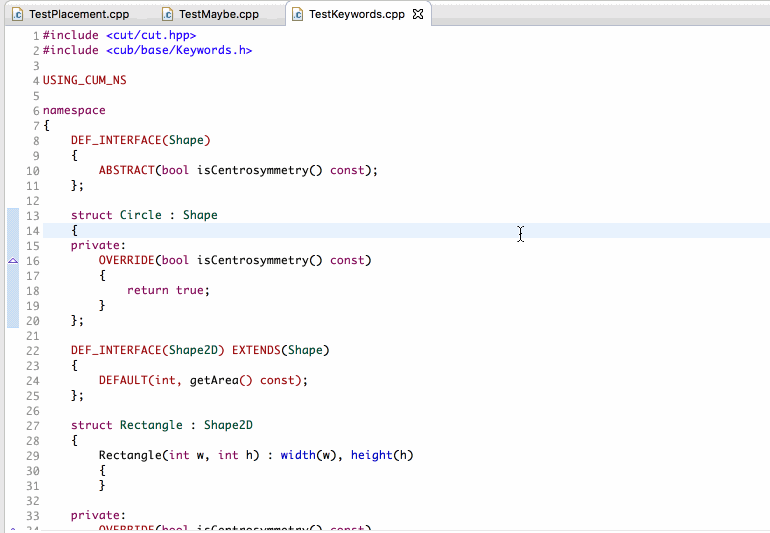

- 代码生成视图（Quick Implementation）

	用`Alt + Shift + S`可以调出代码生成视图。利用该视图可以快捷地为代码添加头文件、格式化代码风格、自动为类成员生成get/set方法等。

    如下使用该快捷视图为类的成员函数自动在cpp文件中生成实现原型。

	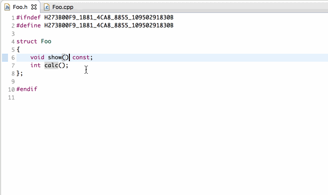

- 继承关系（Hierarchy View）

	大多数eclipse用户都知道选中类名然后敲`F4`，继承关系视图会出现在`Editor`底下的的视图集窗口里。然后在该视图下，可以看类的继承关系和接口的覆写关系。

    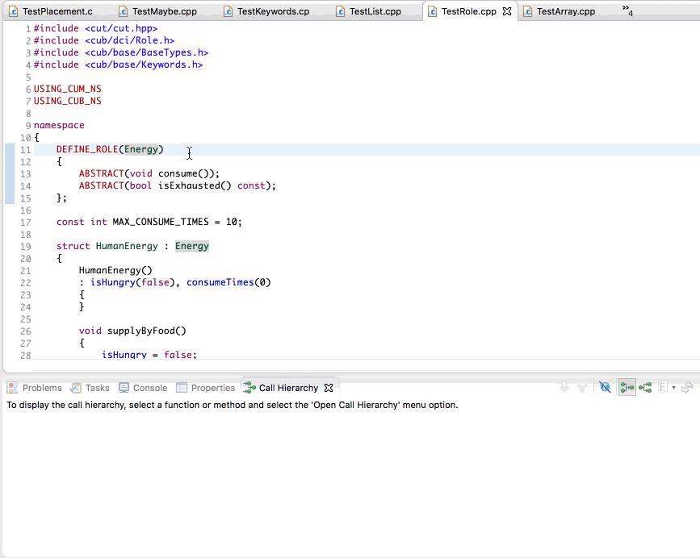

    从上面示例中可以看到，从`Hierarchy View`返回`Editor`需要切换视图焦点。但是如果用`Ctrl + T`调出quick hierarchy，则可以在浏览完继承关系后直接返回到`Editor`的对应位置上。如下所示：

    

    Quick hierarchy是我最喜欢的feature，它可以让类的继承关系跳转变得非常快捷。而且当你在一个虚方法的签名上调出quick hierarchy，只会显示该接口被覆写的类层次。所以让我们记住这个快捷键`Ctrl + T`。

### Navigate

如下是一些比较常用的导航快捷键。

- 文件导航

    - `Ctrl + Shift + R` : 跳转到指定文件。输入文件名时可以用通配符。
    - `Ctrl + F6`， `Ctrl + Shift + F6`：跳转到前一个或者后一个已经打开过的文件。
    - `Ctrl + E`：以quick view的方式列出已经打开过的所有文件列表，可以通过搜索或者上下键选择跳转到的目标文件。
    - `Ctrl + Tab`：在类的头文件和源文件之间互相跳转。

- 符号导航

    - `Ctrl + Shift + T`：跳转到指定符号。可以是类名、全局变量、宏等等；输入符号名时可以使用通配符。
    - `F3`：跳转到定义。
    - `Alt + ←`：跳转到前一个编辑的页面。
    - `Alt + →`：跳转到后一个编辑的页面。
    - `Ctrl + Q`：跳转到最后编辑过的页面符号处。
    - `Ctrl + L`：跳转到指定行。

### Search

Eclipse主要的搜索快捷键如下：

- `Ctrl + Shift + G`：查找所有对符号的引用。
- `Ctrl + Shift + H`：查找所有函数或者变量的调用点，显示出所有调用层次。
- `Ctrl + F`：本文件内搜索，可以通过`Ctrl + k`和`Ctrl + Shift + k`在所有搜索结果中上下跳转。
- `Ctrl + H`：工程内全局搜索。弹出的对话框里面的`C/C++ Search`只是在所有代码文件里面搜索，而`File Search`则是在所有文件内搜索。

### Edit

对于高效编辑来说，有太多的快捷键可说了，我们挑一些重要的略作介绍。

首先你要掌握最基本的通用快捷键:
- `Ctrl + C`：拷贝
- `Ctrl + X`：剪贴
- `Ctrl + V`：粘贴
- `Ctrl + ←`：光标跳过前一符号
- `Ctrl + →`：光标跳过后一符号
- `Shift + ←`：选中前一个字符
- `Shift + →`：选中后一个字符
- `Shift + ↑`：从光标位置往上选中一行
- `Shift + ↓`：从光标位置往下选中一行
- `Ctrl + Shift + ←`：选中前一个符号
- `Ctrl + Shift + →`：选中后一个符号

其次你要掌握eclipse自身的一些编辑快捷键：
- `Ctrl + D`：删除当前行
- `Ctrl + /`：注释当前行
- `Alt + ↑`：将当前行向上移动
- `Alt + ↓`：将当前行向下移动
- `Ctrl + Alt + ↑`：将当前行向上复制
- `Ctrl + Alt + ↓`：将当前行向下复制

如下示例中选择了几行代码，然后使用`Ctrl + Alt + ↓`向下复制了选中行。

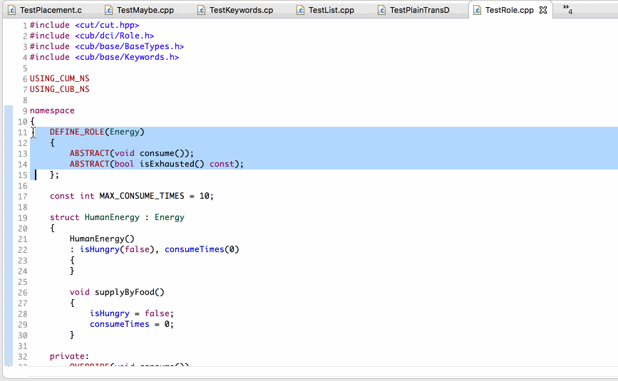

- `Alt + /`：自动提示、补全符号，包括自定义的快捷代码块。如下输入`switch`后使用`Alt + /`，eclipse自动补全switch代码块。

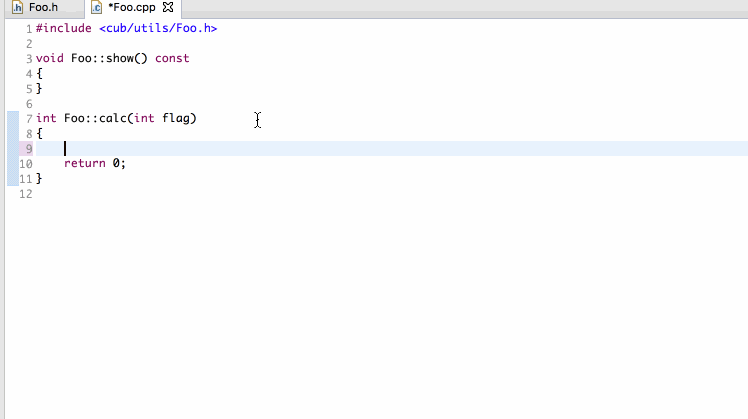

自动补全还包括用户自定义的快捷代码块。如前面介绍全局配置的时候我们添加了`cn`的快捷代码块，如下输入`cn`后再敲`Alt + /`，它帮我们自动补全为“ClassName::”。

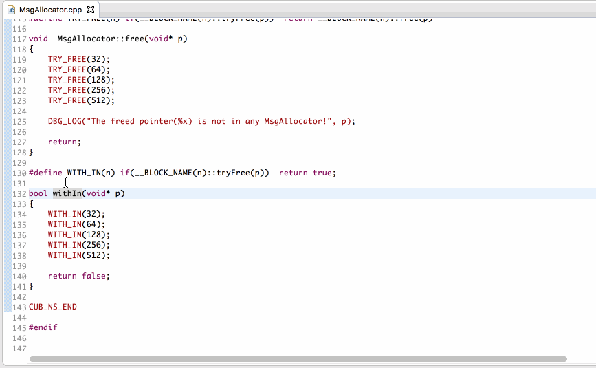

另外还有如下几个非常方便的快捷键：

- `Ctrl + Shift + F`：格式化选中的代码
- `Ctrl + Shift + X`：选中的代码转为全小写
- `Ctrl + Shift + Y`：选中的代码转为全大写
- `Ctrl + Alt + A`：进入或者退出列编辑模式

列编辑模式有时会很有用，如下图所示：

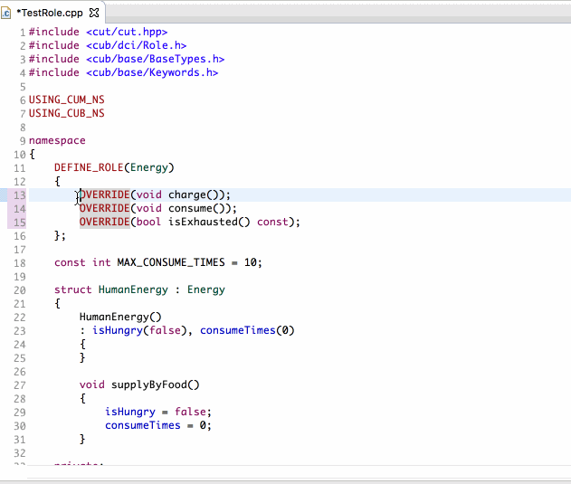

除了上述快捷键外，还有一些是专门针对C/C\++语言特征的。

- `Ctrl + Shift + N`：自动添加光标所在处符号对应的头文件。

    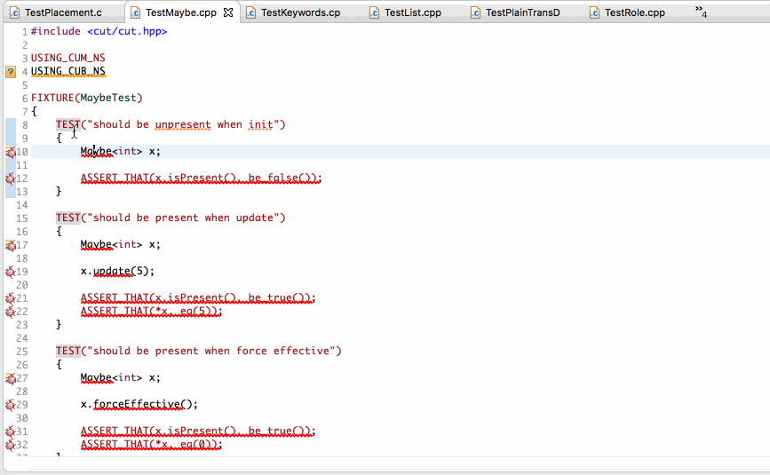

- `Ctrl + =`：自动宏展开提示。

    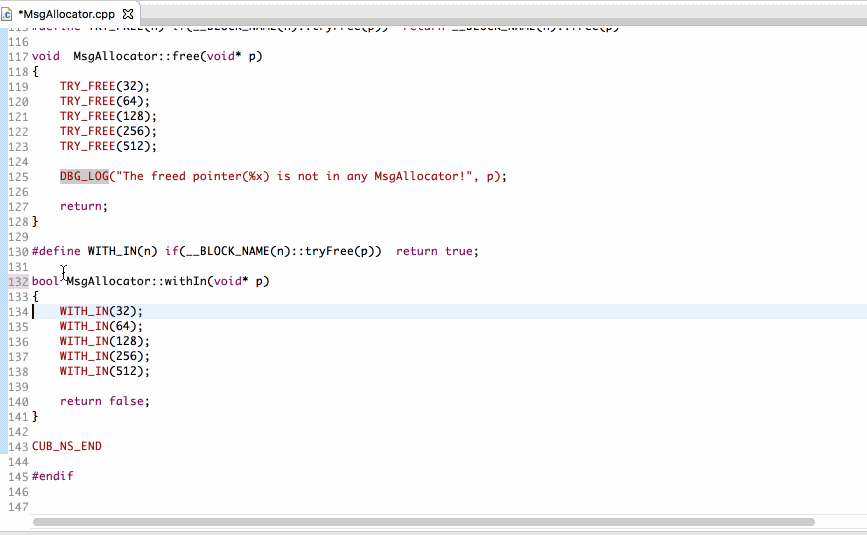

- `Alt + Shift + R`：自动重命名

	Eclipse针对C\++的自动化重构支持的并不多，但是最常用的重命名`Alt + Shift + R`做得真心不错。如果你按照eclipse全局规则中约束的方式命名类和文件（前面全局配置中讲过如何修改规则），例如对于类名“ThreadPool”，对应的头文件命名为“ThreadPool.h”，源文件命名“ThreadPool.cpp”，测试文件名为“TestThreadPool.cpp”，那么对类重命名后对应的头文件、源文件和测试文件以及所有的`#include`对应的文件名都会一起发生改变。

    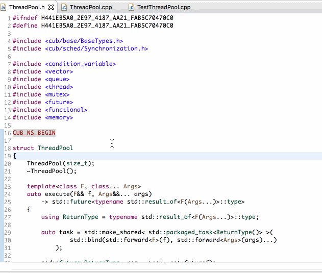

	这里再补充一下，如果你想调整头文件或者目录的位置，最好使用`Project Explorer`视图中右键菜单里面的`Move`选项，这样所有更改路径的头文件的`#include`路径会一起发生变化。

#### Others

本节介绍了非常多的快捷键，如果忘记了，可以输入`Ctrl + Shift + L`调出快捷键列表查看，并可以直接选择执行。

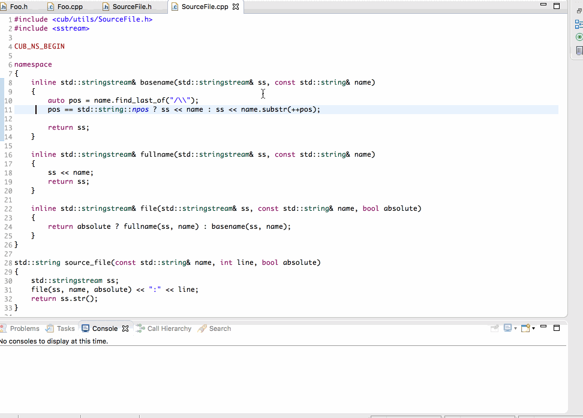

还有一个最牛逼的命令`Ctrl + 3`，使用它可以调用`quick access`对任何属性、视图、命令进行查找、执行。

如下我们输入`Ctrl + 3`转到`quick access`，然后通过输入“font”查找并调出修改字体的全局配置框：

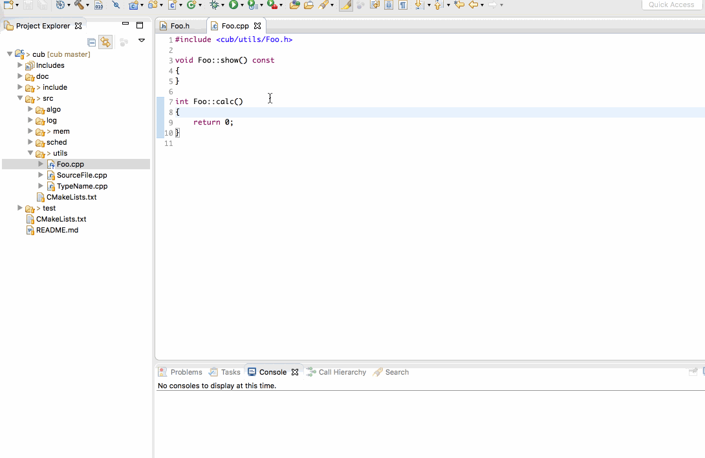

下例中我们通过`quick access`查找添加头文件的命令，然后运行其为我们自动添加了缺失的头文件：

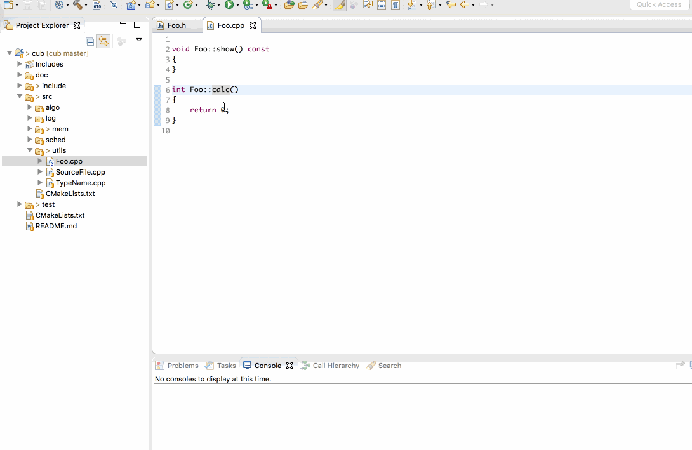

本节的所有介绍就到这里，所提到的快捷键是我挑选出来最常使用的一部分，相信熟练掌握这些足以让你的编码效率得到很大提高。补充说明一下，上述所有快捷键适合linux和windows系统，mac下得要做一些调整，具体查看mac版本eclipse的快捷键设置。

## Conclusion

本文总结了如何高效使用eclipse CDT进行C\++代码开发的一些经验，包括eclipse全局配置、工程配置以及常用的高效操作技巧。希望通过本文使得感兴趣的开发人员可以借助eclipse这个强大的IDE去更好地使用C\++这门强大的语言解决问题。
